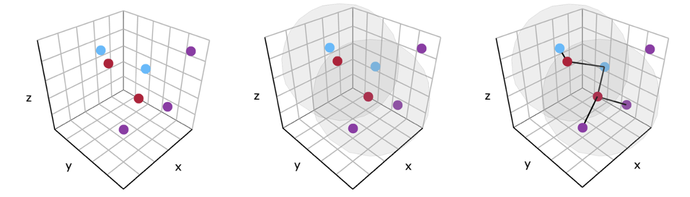
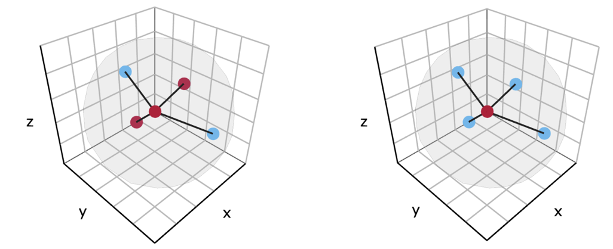

```{r, include = FALSE}
knitr::opts_chunk$set(
  collapse = TRUE,
  comment = "#>"
)
```

```{r setup}
library(SPIAT3D)
```

# Introduction
Cell colocalization metrics help to quantify whether different cell types exist
in the close proximity, which may indicate cell-to-cell communication.

There are 9 different cell colocalization metrics available in SPIAT3D:

1. Neighbourhood counts (NC)

2. Cells in neighbourhood (CN)

3. Neighbourhood entropy (NE)

4. Mixing score (MS)

5. Normalised mixing score (NMS)

6. Cross K-function (CK)

7. Cross L-function (CL)

8. Cross G-function (CG)

9. Co-occurrence (COO)

This vignette will go through how to use these colocalization metrics, plus some
extra stuff :). Firstly, you will need 3D spatial data to analyse. I will be 
using a simulated dataset available in this package.

```{r}
# Get simulated SpatialExperiment object to use as an example for analysis
simulated_spe <- readRDS(system.file("extdata", "simulated_spe.RDS", package = "SPIAT3D"))

print(simulated_spe)

plot_cells3D(simulated_spe,
             plot_cell_types = c("Tumour", "Immune", "Endothelial", "Others"),
             plot_colours = c("orange", "skyblue", "tomato", "lightgray"),
             feature_colname = "Cell.Type")

```

# The basic premise of these metrics
These metrics all work in a similar way. For the cell types you are interested
in, draw a sphere around them. Tally the number of cells inside each sphere and
use this to calculate the cell colocalization metric. The method of calculation
is what distinguishes each metric, each providing slightly different information 
to help quantify colocalization. The radius of the sphere and the cell types of
interest are dependent on your user input.

Later, when I say 'number of cell X interacting with cell Y', I simply mean the 
'number of cell X inside the sphere drawn around cell Y' - I might interchange
between these two phrases, but they mean the same thing.

See the image below for a visual representation of cell colocalization. We've
chosen to draw spheres around the red cells, and we're counting how many blue
and purple cells are found in each sphere. 

Here, the red cells represent the "reference" cell type, while the blue and 
purple cells represent the "target" cell type.
```{r out.width='80%'}
# Showing nice image to describe cell colocalization concept

```

# 1. Neighbourhood counts (NC)
This function is straight forward. It is simply the number of target cells found
within the sphere drawn around each reference cell. A higher number suggests a
higher degree of colocalization.
```{r}
neighbourhood_counts <- calculate_neighbourhood_counts3D(
    spe = simulated_spe,
    reference_cell_type = "Tumour",
    target_cell_types = c("Tumour", "Immune"),
    radius = 30,
    feature_colname = "Cell.Type"
)

# Summarise data
summarise_neighbourhood_metric3D(neighbourhood_counts)
```

# 2. Cells in neighbourhood (CIN)
Cells in neighbourhood (CIN) is a metric used in SPIAT that extends the NC 
metric by measuring the proportion of those interactions: specifically, the 
fraction of interacting cells that are target cells, relative to the number of 
target and reference cells interacting with the reference cell. By analysing
the relative proportion, we yield different information that might not be
apparent when considering absolute counts alone with the NC metric.

Note that it doesn't make much sense to make the reference and target cell type
the same, I've set the output to just be 1 for this case.

```{r}
cells_in_neighbourhood <- calculate_cells_in_neighbourhood3D(
    spe = simulated_spe,
    reference_cell_type = "Tumour",
    target_cell_types = c("Tumour", "Immune"),
    radius = 30,
    feature_colname = "Cell.Type"
)

# Summarise data
summarise_neighbourhood_metric3D(cells_in_neighbourhood)
```

# 3. Neighbourhood entropy (NE)
In simple terms and for our case, entropy can be viewed as:

If things are balanced, entropy is high.

If things are unbalanced and there is alot of one thing compared to another, 
entropy is low.

If we extend this idea to CIN, we calculate neighbourhood entropy (NE) by 
seeing if the proportion of interacting reference and target cells is 
similar/balanced (i.e. 50% reference and 50% target) around each reference cell.

In the image below, the proportion of red and blue cells around the red cell is 
balanced, so entropy is maxed at 1. But on the right, its dominated by blue 
cells, so entropy is 0.
```{r out.width='80%'}
# Showing nice image to describe neighbourhood entropy concept

```

Note that it makes zero sense to make the reference and target cell type the 
same, I've set the output to be NA for this case.
```{r}
neighbourhood_entropy <- calculate_neighbourhood_entropy3D(
    spe = simulated_spe,
    reference_cell_type = "Tumour",
    target_cell_types = c("Tumour", "Immune"),
    radius = 30,
    feature_colname = "Cell.Type"
)

# Summarise data
summarise_neighbourhood_metric3D(neighbourhood_entropy)
```


# 4 and 5. Mixing score (MS) and normalised mixing score (NMS)
I've combined these two metrics here, because their both outputted by the same
function.

The mixing score metric operates differently to NC, CIN and NE because it 
outputs a single value as opposed to an individual value for each reference 
cell. It does this through summation. It is calculated by:

1. Summing the all the NC values of a chosen target cell type across all the
reference cell 
2. Summing the all the NC values of the chosen reference cell type across all
the reference cells.
3. Taking the ratio.

A high MS suggests frequent interaction between reference and target cells while
a low MS suggests limited interaction and a tendency for reference cells to 
cluster with other reference cells.

The normalised mixing score (NMS) is just that - a normalised version of the 
mixing score. It is normalised so that NMS equals 1 when applied to a tissue
where the reference and target cell are randomly arranged, following a complete
spatial randomness pattern.

```{r}
mixing_scores <- calculate_mixing_scores3D(
    spe = simulated_spe,
    reference_cell_types = c("Tumour", "Immune"),
    target_cell_types = c("Tumour", "Immune"),
    radius = 30,
    feature_colname = "Cell.Type"
)

print(mixing_scores)
```


# 6. Cross K-function (CK)
The cross K-function (CK) is similar to the MS function, as it outputs a single
value for the tissue it is applied to. It differs because it utilises the volume
of the tissue it is analysing.

It is calculated by finding the average number of target cells interacting with
each reference cell, and then, finding the density of target cells in the 
tissue (which requires tissue volume). The ratio between these two values gives 
the observed CK.

The expected CK is the CK value when the cells in the tissue are arranged
randomly following a complete spatial randomness arrangement. An observed CK 
greater than the expected CK indicates clustering between the reference and 
target cell, while the opposite indicates repulsion.

Note that the expected CK is a constant and does not depend on the cell types 
you input, it only depends on the radius.

```{r}
cross_K <- calculate_cross_K3D(
    spe = simulated_spe,
    reference_cell_type = "Tumour",
    target_cell_types = c("Tumour", "Immune"),
    radius = 30,
    feature_colname = "Cell.Type"
)

print(cross_K)
```


# 7. Cross L-function (CL)
The cross L-function (CL) is a linearised form of the CK. CL will show the same
trends as CK, but the trends will grow linearly, which may be easier to 
interpret than CK, which follows cubic growth in 3D.

```{r}
cross_L <- calculate_cross_L3D(
    spe = simulated_spe,
    reference_cell_type = "Tumour",
    target_cell_types = c("Tumour", "Immune"),
    radius = 30,
    feature_colname = "Cell.Type"
)

print(cross_L)
```


# 8. Cross G-function (CG)
Despite the name, the cross G-function (CG) is quite different from CK and CL.
CG focuses only on the nearest target cell, potentially making it more sensitive 
to small-scale cell-cell interactions. Specifically, the CG gives the proportion 
of reference cells whose nearest target cell neighbour is within the sphere
drawn around each reference cell.

Like CK and CL, an expected CG can be found and compared to. However, the
expected CG does depend on the cell types you choose, as well as the radius.

When compared to a complete spatial randomness distribution, observed CG values 
above the expected CG suggests clustering between reference and target cells, 
while the opposite suggests repulsion.

```{r}
cross_G <- calculate_cross_G3D(
    spe = simulated_spe,
    reference_cell_type = "Tumour",
    target_cell_type = "Immune",
    radius = 5,
    feature_colname = "Cell.Type"
)

print(cross_G)
```


# 9. Co-occurrence (COO)
Co-occurrence (COO) is a spatial metric implemented in the squidpy package,
which has been adapted to SPIAT3D.

For a given sphere radius, a COO metric is calculated by determining the average
proportion of target cells found within the spheres of the reference cells, and 
comparing this to the overall proportion of target cells found within the 
tissue. 

If the cells in the tissue followed a complete spatial randomness distribution, 
COO would equal 1, as the proportion of target cells around reach reference cell 
would match the proportion of target cells in the tissue sample. 

Hence, interpreting co-occurrence is straightforward, as observed COO values 
greater than 1 indicate clustering between reference and target cells, while 
values less than 1 indicate repulsion.

```{r}
co_occurrence <- calculate_co_occurrence3D(
    spe = simulated_spe,
    reference_cell_type = "Tumour",
    target_cell_types = c("Tumour", "Immune"),
    radius = 30,
    feature_colname = "Cell.Type"
)

print(co_occurrence)
```


# Gradient-based forms of these metrics
These 9 metrics are calculated for a single distance/sphere radius – this gives 
users the ability to choose the type of cellular interactions they are 
interested in. For example, setting this distance to be slightly larger than the 
diameter of a cell may implicate cell-cell interactions, while using a much 
larger distance may provide information about indirect communication between 
cells. 

However, to avoid making an (often arbitrary) decision on the radius, an 
alternative is to observe how these metrics behave across a gradient of 
increasing sphere radii and plotting the output of the chosen metric against 
this gradient of sphere radii. This is traditionally how the CK, CL and CG are 
calculated.

For MS, NMS, CK, CL, CG, and COO, a single value is outputted for each sphere 
radius, and the gradient-based graph can be plotted. In contrast, for NC, CIN, 
and NE, each reference cell has its own corresponding value. Therefore, to plot 
the gradient-based graph for these metrics, an average value across all 
reference cells is calculated for each sphere radius.

By calculating these cell colocalization metrics across a gradient, we can 
understand how the levels of interaction between cells varies at different 
distances.

```{r}
# Calculating cells in neighbourhood gradient
cells_in_neighbourhood_gradient <- calculate_cells_in_neighbourhood_gradient3D(
    spe = simulated_spe,
    reference_cell_type = "Tumour",
    target_cell_types = c("Tumour", "Immune"),
    radii = seq(20, 100, 10),
    feature_colname = "Cell.Type",
    plot_image = TRUE
)

# Calculating cross L gradient
cross_L_gradient <- calculate_cross_L_gradient3D(
    spe = simulated_spe,
    reference_cell_type = "Tumour",
    target_cell_types = c("Tumour", "Immune"),
    radii = seq(20, 100, 10),
    feature_colname = "Cell.Type",
    plot_image = FALSE
)

# Note that these gradient based functions have their own plotting function so
# that you don't have to re-run the function to plot the analysis.
plot_cross_L_gradient3D(cross_L_gradient)
```


# Combining all these functions
I have two special functions that allow you to calculate all these metrics at 
once. One function for a single radius, and another function for a gradient of
radii. 

I found this useful for large analysis projects, where I got lazy writing
each function one by one.

```{r}
# Function to calculate all cell colocalization metrics for a single radius
single_radius_cc_output <- calculate_all_single_radius_cc_metrics3D(
    spe = simulated_spe,
    reference_cell_type = "Tumour",
    target_cell_types = c("Tumour", "Immune"),
    radius = 30,
    feature_colname = "Cell.Type"
)

# Function to calculate all cell colocalization metrics for a gradient of radii
gradient_cc_output <- calculate_all_gradient_cc_metrics3D(
    spe = simulated_spe,
    reference_cell_type = "Tumour",
    target_cell_types = c("Tumour", "Immune"),
    radii = seq(20, 100, 10),
    feature_colname = "Cell.Type",
    plot_image = FALSE # I'm not going to plot, because there are many plots
)
```

