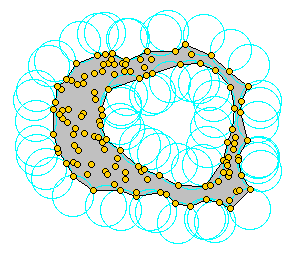
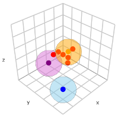

```{r, include = FALSE}
knitr::opts_chunk$set(
  collapse = TRUE,
  comment = "#>"
)
```

```{r setup}
library(SPIAT3D)
```

# Introduction
SPIAT3D has three clustering algorithms to identify cell clusters within 3D
spatial data. Some have been adapted from the original SPIAT, some are new. 

This vignette will go through each of them. Firstly, you will need 3D
spatial data to analyse. I will be using a simulated dataset available in this
package.

```{r}
# Get simulated SpatialExperiment object to use as an example for analysis
simulated_spe <- readRDS(system.file("extdata", "simulated_spe.RDS", package = "SPIAT3D"))

print(simulated_spe)

plot_cells3D(simulated_spe,
             plot_cell_types = c("Tumour", "Immune", "Endothelial", "Others"),
             plot_colours = c("orange", "skyblue", "tomato", "lightgray"))

```

# Alpha hull clustering
The alpha hull was proposed by Herbert Edelsbrunner in his PhD thesis. I'm not
going to go into the specifics because I'm not an expert, but I would boil it
down to this:

"If you can draw an empty circle that only touches two points, those two points
are part of the border of the alpha hull."

Check out the image below, I'm not lying, each circle is empty and only touches 
two points. Image from [link](https://doc.cgal.org/latest/Alpha_shapes_2/). 
Points enclosed between the circles are part of the alpha hull itself.
```{r out.width='60%'}
# Showing nice image to describe alpha hulls

```

This applies to 2D and can be extended to 3D by using spheres instead. The
radius of the sphere (i.e. the alpha value) can be selected by the user. A small 
alpha value can lead to more clusters with more intricate borders (but may also 
miss clusters as a result), while a large alpha value can result in fewer, 
larger and less curved clusters.

```{r}
# Alpha hull clustering

# Alpha hull clustering depends on alphashape3d package, which depends on rgl
# package, and you might need to run this code, as newer mac versions don't
# support rgl.
if (Sys.info()[["sysname"]] == "Darwin") {
  options(rgl.useNULL = TRUE)
  options(rgl.printRglwidget = TRUE)
}

# Note that the alpha value is very sensitive, at least in this data.
# Too high and you can't identify separate clusters, especially when the
# clusters are close togehter, but too low, and you miss some cells in each 
# cluster.
alpha_hull_spe <- alpha_hull_clustering3D(
    spe = simulated_spe,
    cell_types_of_interest = c("Tumour", "Immune"),
    alpha = 4.5,
    minimum_cells_in_cluster = 30,
    feature_colname = "Cell.Type",
    plot_image = FALSE
)

# Plot alpha hull clusters separately with your own colours for each cell type. 
# No, you can't change the color of the alpha hulls :(
plot_alpha_hull_clusters3D(
    spe_with_alpha_hull = alpha_hull_spe,
    plot_cell_types = c("Tumour", "Immune", "Endothelial", "Others"),
    plot_colours = c("orange", "skyblue", "tomato", "lightgray"),
    feature_colname = "Cell.Type"
)
```


# DBSCAN clustering
DBSCAN clustering is a straight forward clustering algorithms. In a 3D tissue,
draw a sphere around each cell type you are interested in. If there are enough
cells of interest inside the sphere around 'cell X', then 'cell X' is part of
the cluster. Naturally, cells which surpass this threshold are found clustered
together. 

The user can specify what cells they are interested in, the radius of the
sphere, the minimum number of cells needed in each sphere to be counted as part 
of a cluster, and the minimum number of cells needed for a cluster to be called
a cluster - some clusters may only contain 5 cells, and you might want to focus
on the bigger clusters.

```{r}
# DBSCAN clusters
dbscan_spe <- dbscan_clustering3D(
    spe = simulated_spe,
    cell_types_of_interest = c("Tumour", "Immune"),
    radius = 8,
    minimum_cells_in_radius = 10,
    minimum_cells_in_cluster = 30,
    feature_colname = "Cell.Type",
    plot_image = TRUE
)

# Plotting separately so it appears on GitHub pages, but the function should do
# this if you set plot_image = TRUE
dbscan_spe_to_plot <- dbscan_spe
dbscan_spe_to_plot$dbscan_cluster <- ifelse(dbscan_spe_to_plot$dbscan_cluster == 0, "non_cluster", paste("cluster_", dbscan_spe_to_plot$dbscan_cluster, sep = ""))
plot_cells3D(dbscan_spe_to_plot, feature_colname = "dbscan_cluster")
```


# Grid based clustering
Grid based clustering is my own self-created algorithm, although, definitely not
an original idea. 

Take your 3D tissue and divide it into smaller rectangular prisms. Some of those 
rectangular prisms will have a high proportion of cells  you are interested in, 
and some won't. In theory, the rectangular prisms that have a higher proportion 
of cells you are interested in might form part of cell cluster. Divide those 
rectangular prisms again, and repeat. If you keep dividing, keeping the 
rectangular prisms that have a high proportion of cells you are interested in, 
you're gonna end up with a bunch of differently sized rectangular prisms that 
collectively define your cluster.

```{r}
# Grid based clusters
grid_based_spe <- grid_based_clustering3D(
    spe = simulated_spe,
    cell_types_of_interest = c("Tumour", "Immune"),
    n_splits = 10,
    minimum_cells_in_cluster = 30,
    feature_colname = "Cell.Type",
    plot_image = TRUE
)

# Can also plot grid based clusters separately with your own colours :) for each
# cell type. No, you can't change the color of the prisms which form the
# clusters :(
plot_grid_based_clusters3D(
    spe_with_grid = grid_based_spe,
    plot_cell_types = c("Tumour", "Immune", "Endothelial", "Others"),
    plot_colours = c("orange", "skyblue", "tomato", "lightgray"),
    feature_colname = "Cell.Type"
)
```

# Further analysis of the clusters
Once you have identified the clusters, SPIAT3D offers several functions that can
help analyse certain aspects of the clusters. These include:

1. identifying the cells that make up each cluster

2. identifying the cells that border each cluster

3. determining how close other cells are to each cluster

4. calculating the approximate centre of each cluster

5. calculating the volume of each cluster


# 1. Cell proportions of each cluster
```{r}
# Using alpha hull clusters
cluster_cell_props <- calculate_cell_proportions_of_clusters3D(
    spe = alpha_hull_spe,
    cluster_colname = "alpha_hull_cluster",
    feature_colname = "Cell.Type",
    plot_image = T
)

print(cluster_cell_props)
```

# 2. Borders of each cluster
To determine which cells form the border just outside each cluster, we developed
the following algorithm. Draw a sphere around each cell that does NOT form part 
of a cluster. If the number of cluster cells found in each sphere is:

1. Above the threshold, it is defined as infiltrating the cluster (inside the cluster)

2. At least one but below the threshold, it is defined as on the border of the cluster

3. Zero, it is neither infiltrating nor on the border of the cluster.

Check out the image below. The orange cell is inside the cluster because its
surrounded by too many red cells, the purple cell is part of the cluster border
because its only near one red cell and the blue cell is all by itself.
```{r out.width='50%'}
# Showing nice image to describe how to find border of clusters

```

The threshold used is the median number of cluster cells found in all the
spheres, as this provided a robust threshold value.

```{r}
# Using dbscan clusters
spe_with_border_of_clusters <- calculate_border_of_clusters3D(
    spe = dbscan_spe,
    radius = 8,
    cluster_colname = "dbscan_cluster",
    feature_colname = "Cell.Type",
    plot_image = TRUE
)

# Plotting separately so it appears on GitHub pages, but the function should do
# this if you set plot_image = TRUE
plot_cells3D(spe_with_border_of_clusters, feature_colname = "cluster_border")
```

# 3. Minimum distances to each cluster
This functions calculates the distance FROM cells not in a cluster TO the
closest cell in each cluster. This aims to quantify interactions between cluster
and non-cluster cells. For example, it may reveal groups of immune cells in 
close distance with a tumour cluster, or potentially show separation instead.
```{r}
# Using grid based clusters
# For some reason, using methods::show on a facet ggplot object can show
# several plots, but only the last plot matters.
minimum_distances_to_clusters <- calculate_minimum_distances_to_clusters3D(
    spe = grid_based_spe,
    cell_types_inside_cluster = c("Tumour"),
    cell_types_outside_cluster = c("Tumour", "Immune"),
    cluster_colname = "grid_based_cluster",
    feature_colname = "Cell.Type",
    plot_image = TRUE
)
```

# 4. Centre of each cluster
The average x,y,z coordinates of all the cells within a cluster gives a rough
estimate for the centre of each cluster. This might be useful as for example,
the centre of a tumour cluster can serve as a reference point to analyse the 
spatial relationship between surrounding structures, such as blood vessels, 
nerves, or other organs.
```{r}
# Using dbscan clusters
cluster_centres <- calculate_center_of_clusters3D(
    spe = dbscan_spe,
    cluster_colname = "dbscan_cluster"
)
print(cluster_centres)
```


# 5. Volume of each cluster
The volume of a cluster can be calculated through a variety of ways, depending 
on which clustering algorithm used. 

One way is to determine the proportion of cells in a cluster relative to the 
entire tissue, and then multiplying by the volume of the entire tissue (density
method). This method is applicable to all 3 clustering algorithms.

Another way is through the volume calculator exclusive to the alphashape3d 
package.

Another way for the grid based clustering method is to sum the volume of each
rectangular prism that makes up each grid based cluster.
```{r}
# Using alpha hull clusters
volume_of_alpha_hull_clusters <- calculate_volume_of_clusters3D(
    spe = alpha_hull_spe,
    cluster_colname = "alpha_hull_cluster"
)
print(volume_of_alpha_hull_clusters)

# Using dbscan clusters
volume_of_dbscan_clusters <- calculate_volume_of_clusters3D(
    spe = dbscan_spe,
    cluster_colname = "dbscan_cluster"
)
print(volume_of_dbscan_clusters)

# Using grid based clusters
volume_of_grid_based_clusters <- calculate_volume_of_clusters3D(
    spe = grid_based_spe,
    cluster_colname = "grid_based_cluster"
)
print(volume_of_grid_based_clusters)
```
