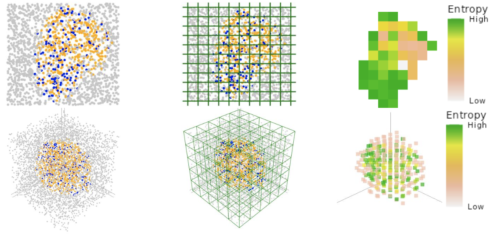

```{r, include = FALSE}
knitr::opts_chunk$set(
  collapse = TRUE,
  comment = "#>"
)
```

```{r setup}
library(SPIAT3D)
```

# Introduction
Spatial heterogeneity is defined as the variation in the distribution of cells 
across a tissue. It can help visualise and quantify the uneven arrangements of 
for example cancerous cells in a tumour sample.

It adapts the method used in SPIAT, and involves breaking down the 3D tissue 
into a grid of many rectangular prisms, the number of which can be controlled by 
the user. The cellular composition and spatial location of each rectangular 
prism are then used as input for spatial heterogeneity metrics in SPIAT3D. See 
the image below for a 2D and 3D visual representation.

```{r out.width='80%'}
# Showing nice image to describe spatial heterogeneity concept

```

This vignette will go through how to use the spatial heterogeneity metrics. 
Firstly, you will need 3D spatial data to analyse. I will be using a simulated 
dataset available in this package.

```{r}
# Get simulated SpatialExperiment object to use as an example for analysis
simulated_spe <- readRDS(system.file("extdata", "simulated_spe.RDS", package = "SPIAT3D"))

print(simulated_spe)

plot_cells3D(simulated_spe,
             plot_cell_types = c("Tumour", "Immune", "Endothelial", "Others"),
             plot_colours = c("orange", "skyblue", "tomato", "lightgray"))
```


# Calculating metrics in each rectangular prism
Each rectangular prism in the 3D grid of the tissue will have a mixture of 
cells. Using the number of different cell types found in each rectangular prism, 
an individual metric value can be calculated: proportion or entropy. The
collective metric values we get from all the rectangular prisms yields us with
the overall 'grid metrics', which we can analyse later.

If we select a reference and target cell type, we can find the proportion of 
target cell types relative to reference and target cell types in each 
rectangular prism.
```{r}
cell_prop_grid_metrics <- calculate_cell_proportion_grid_metrics3D(
    spe = simulated_spe,
    n_splits = 10,
    reference_cell_types = c("Others"),
    target_cell_types = c("Tumour", "Immune"),
    feature_colname = "Cell.Type",
    plot_image = T
)

# Plot
plot_grid_metrics_continuous3D(cell_prop_grid_metrics, "proportion")

```

If we select a group of cell types, we can find the entropy of each rectangular
prism. The equation for entropy can be found in our manuscript/paper. But,
essentially, for example, if you are interested in Tumour and Immune cells,
entropy will be higher in a rectangular prism if the proportion of Tumour and
Immune cells in the rectangular prism is similar (i.e. 50% Tumour and 50% 
Immune).

```{r}
entropy_grid_metrics <- calculate_entropy_grid_metrics3D(
    spe = simulated_spe,
    n_splits = 10,
    cell_types_of_interest = c("Tumour", "Immune"),
    feature_colname = "Cell.Type",
    plot_image = T
)

# Plot
plot_grid_metrics_continuous3D(entropy_grid_metrics, "entropy")
```

# Prevalence and prevalence gradient
After obtaining your grid metrics, we can calculate 'prevalence'. If we choose a
threshold, prevalence is simply the proportion of rectangular prisms that have a 
metric value above (or below) this threshold.

The metric values (proportion or entropy) always range from 0 to 1 due to how 
the values are calculated, so the threshold must be between 0 and 1.

Instead of choosing a single threshold, prevalence gradient uses a range of
threshold values, from 0 to 1. The relationship between prevalence and threshold
can be shown. The AUC for the prevalence gradient is also calculated and may be 
a useful value for analysis too.

How do you interpret the prevalence gradient?

The graph can only be horizontal/flat or go down. It can't go up because when
the threshold rises, the number of rectangular prisms that surpass this 
threshold must drop (or stay constant).

If it stays flat, then there must be a group of rectangular prisms with a very
high metric value, and another group with a relatively lower metric value. You
might see this when you have a 3D tissue with well defined cell clusters,
surrounded by a relatively blank background.

If it tends to drop, then metric values across the rectangular prisms must be
more spread from low to high.

```{r}
# Get prevalence from cell proportion grid metrics
prevalence <- calculate_prevalence3D(
    grid_metrics = cell_prop_grid_metrics,
    metric_colname = "proportion",
    threshold = 0.3,
    above = TRUE
)
print(prevalence)

# Get prevalence gradient from cell proportion grid metrics
prevalence_gradient <- calculate_prevalence_gradient3D(
    grid_metrics = cell_prop_grid_metrics,
    metric_colname = "proportion",
    show_AUC = T,
    plot_image = TRUE
)

# Get prevalence gradient from entropy grid metrics
prevalence_gradient <- calculate_prevalence_gradient3D(
    grid_metrics = entropy_grid_metrics,
    metric_colname = "entropy",
    show_AUC = T,
    plot_image = TRUE
)
```


# Spatial autocorrelation
Spatial autocorrelation describes the degree to which proportion/entropy values 
at nearby locations are correlated to each other (i.e. how similar nearby prisms 
are). One way to calculate spatial autocorrelation is through Global Moran’s I,
which is the method SPIAT3D uses.

One of the inputs for the spatial autocorrelation formula is a spatial weight 
matrix. The matrix defines which locations are considered ‘neighbours’ and 
how strongly they influence each other. SPIAT3D offers a range of different 
spatial weight matrices to choose from, including "queen", "rook" and "IDW". 

Global Moran's I ranges from -1 to 1. Interpretation of Global Moran’s I is as 
follows:

1.	Positive Global Moran’s I occurs when proportion/entropy values at nearby 
locations are similar, such as when rectangular prisms with high proportion 
values cluster together, and rectangular prisms with low proportion values 
cluster together.

2.	Negative Global Moran’s I when proportion/entropy values at nearby locations 
are dissimilar, such as when rectangular prisms with high entropy values 
surround themselves with rectangular prisms with low entropy values. 

3.	Zero Global Moran’s I suggests no link between proportion/entropy values at 
nearby locations and that the location of each rectangular prism is independent 
of their metric value.

```{r}
# Calculate spatial autocorrelation from cell proportion grid metrics
spatial_autocorrelation <- calculate_spatial_autocorrelation3D(
    grid_metrics = cell_prop_grid_metrics,
    metric_colname = "proportion",
    weight_method = "queen"
)
print(spatial_autocorrelation)
```

